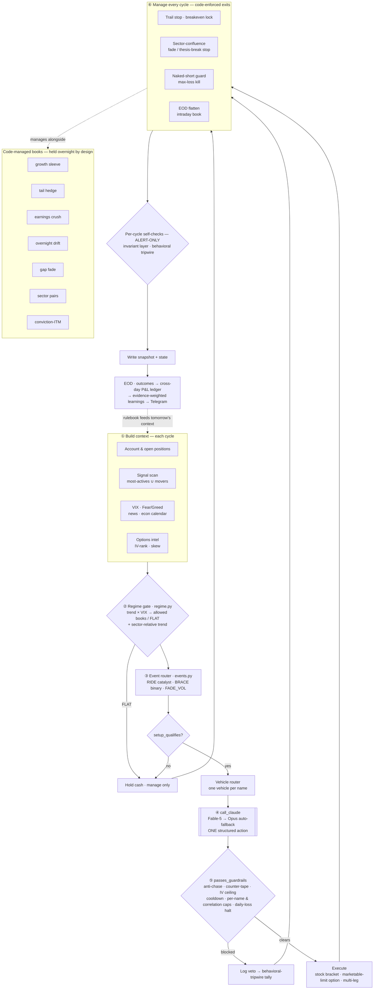

# AutoTrade

Autonomous **Alpaca paper** trading bot for US equities + defined-risk options.
Design principle: **Claude picks, code protects** — one model call per qualifying
cycle proposes a single action, wrapped in deterministic guardrails that can veto or
resize it but never invent a trade.

> **Paper only.** `PAPER=True` is hardcoded. Real keys live in `~/.autotrade.env`
> (chmod 600, outside the repo). Nothing here places live-money orders.

## Workflow at a glance

One model call (box ④) sits inside deterministic gates — **everything else is code**.
Gates *before* it decide whether and what it may propose; gates *after* it can veto or
resize but never invent a trade. Management, books, safety self-checks, and the nightly
learning loop all run as code.



## How a cycle works
1. Build context — account, open positions, a live signal scan (most-actives ∪ movers),
   VIX, fear/greed, breaking news, an economic calendar, and per-name options intel.
2. **Regime gate** (`regime.py`, deterministic) — trend × VIX bands decide which
   strategies may open this cycle (or force FLAT). The model can only fill in strikes
   inside what the regime already authorized. A **sector-relative** overlay judges "with
   the tape" by the name's own sector (semis, megacap, software…), not just SPY — so a
   long into a sector that's quietly rolling over is treated as counter-tape.
3. **Event router** (`events.py`) — two-sided: RIDE a fresh catalyst (inject the name,
   relax anti-chase), BRACE before a scheduled binary (no short premium into it),
   FADE_VOL rich index IV after a spike.
4. **Decide** — `call_claude` sends the context and gets back one structured-JSON action
   (`buy_stock` / `buy_option` / `multi_leg` / `iron_condor` / `close` / `hold`).
5. **Guardrails** (`passes_guardrails`) — regime gate, anti-chase, counter-tape block,
   extreme-IV ceiling, stopped-out cooldown, per-name caps, correlation & notional caps,
   daily loss halt. A trade clears all of them or it doesn't go.
6. **Manage** — every open spread/option/stock is re-judged each cycle; stops trail to
   lock gains and a breakeven lock protects a winner; a **sector-confluence fade stop**
   cuts a position when the name goes adverse off entry *and* its sector is rolling over
   (backtested — a price-only version whipsawed and was rejected); a naked-short guard and
   per-position max-loss kill backstop the defined-risk rule; everything intraday is
   flattened before the close.

After the single exit each cycle, two **alert-only** self-checks run (never touch orders):
an **invariant layer** that catches state corruption (e.g. a phantom day-P&L from a book
collision), and a **behavioral tripwire** that flags the silent failure mode — seeing
setups but not acting, or the model stuck repeating one blocked reason.

## The model (and the Fable fallback)
- Preferred: `claude-fable-5`. Fallback: `claude-opus-4-8` (`config.CLAUDE_MODEL` /
  `CLAUDE_FALLBACK_MODEL`).
- Fable 5 + Mythos 5 were **government-suspended for all users on 2026-06-12** (no
  timeline). `_create_message` tries the preferred model and transparently falls back to
  Opus on a model-unavailable 404. The down-state is per-process, so each cycle re-probes
  Fable — the bot returns to it **automatically** the moment access is restored, and DMs
  you when that happens.

## Self-learning
After each close, `autotrade.py eod` reviews the day's snapshots + realized P&L and
maintains an evidence-weighted **rulebook** (`~/autotrade_learnings.json`), then DMs it to
you on Telegram. Each rule carries a status (`active` / `tentative` / `contested` /
`retired`), a regime `scope`, and `confirmations` / `refutations` counts.

**Contradiction policy (evidence-weighted + hysteresis):** when a new learning conflicts
with a standing one, it's first tested for being *regime-conditional* (scope both rules,
don't pick a winner); only a genuine reversal touches status, a single contradicting day
merely marks the incumbent `contested`, and a just-flipped rule is locked for a cooldown
so it can't thrash. Code enforces the mechanical invariants (hysteresis, clock
preservation, count clamping, silent-delete guard); the model does the semantic work. A
learning can never override the protected human priors in `config.LEARNING_PROTECTED_PRIORS`.

## Files
- `autotrade.py` — the engine (cycle, management, guardrails, learning).
- `config.py` — keys, paths, and all hard guardrails (edit guardrails here).
- `regime.py` / `events.py` / `options_intel.py` — regime gate, event router, IV intel.
- Book modules (separate, code-managed, held overnight by design):
  `growth_sleeve.py`, `overnight_drift.py`, `tail_hedge.py`, `earnings_crush.py`,
  `gap_fade.py`, `sector_pairs.py` (market-neutral stat-arb). Conviction-ITM (deep-ITM
  multi-day longs) lives in `autotrade.py`. `orb.py` / `mean_reversion.py` ship dark
  (`*_ENABLED=False`) — both were backtested and rejected as single-name artifacts.
- `alpaca_system_prompt.txt` — the model's trading instructions.
- `backtest.py` — offline backtest harness.
- `~/.autotrade.env` — secrets (copy from `autotrade.env.template`, chmod 600).

## CLI
```bash
PY=~/autotrade/venv/bin/python3; A=~/autotrade/autotrade.py
$PY $A cycle [--dry-run]   # one decision cycle (dry-run places NO orders)
$PY $A status              # what the engine currently sees
$PY $A pnl                 # account P&L + open positions
$PY $A eod                 # end-of-day: regenerate learnings + DM them
$PY $A backfill [days]     # rebuild learnings from the last N days of logs (default 14)
$PY $A outcomes            # capture the day's realized-P&L / fills to ~/autotrade_outcomes
$PY $A intel SYM           # options intel (ATM IV, IV-rank, skew) for a symbol
$PY $A warm-iv             # seed/refresh IV-rank for the names we trade options on
$PY $A growth | overnight  # run/inspect a specific code-managed book
```

## Local dashboard
A read-only "glass cockpit" — renders live state from the data the engine already
writes each cycle (snapshots / state / outcomes / learnings) plus a couple of live
Alpaca reads. It never trades and binds to **localhost only**.
```bash
~/autotrade/venv/bin/python3 ~/autotrade/dashboard.py   # -> http://127.0.0.1:8787
```
Shows: live equity / day P&L / realized-by-strategy, regime & tape, open positions and
tracked spreads, the **decision & veto stream** (every cycle's action + why a guardrail
blocked it), the signal scan, the learnings rulebook, and an equity curve. Polls every 5s.

## Scheduling (launchd, macOS)
- `com.autotrade.cycle` — runs every 60s; the engine itself decides whether to act
  (conditional cadence: ~3 min when active, ~5 min when quiet).
- `com.autotrade.eod` — weekdays 13:20 PT (16:20 ET): the self-learning pass.
- `com.autotrade.outcomes` — captures realized P&L after the close.
- `com.autotrade.caffeinate` — keeps the Mac awake through market hours.

Install/refresh the jobs:
```bash
bash ~/autotrade/install.sh
```
Pause the main loop anytime:
```bash
launchctl bootout gui/$(id -u)/com.autotrade.cycle
```

## Risk philosophy
Let winners run (no upside caps — long options and stock use a far take-profit so the
trailing stop governs), but keep ruin-prevention guardrails: a daily loss floor, a hard
daily loss halt that flattens the intraday book, defined-risk structures only, and a
hardcoded paper account. The growth sleeve and other hold-through books are separate
long-term books the intraday engine never touches.

## Remote control
- File fallback: `echo "STOP" > ~/autotrade_command.txt`
  Commands: `STOP`, `RESUME`, `CLOSE ALL`, `STATUS`, `STATS`, `FOCUS TECH`,
  `OVERRIDE` (keep trading past the daily loss halt; `OVERRIDE OFF` to undo; resets next day).
- Telegram: add `TELEGRAM_TOKEN` + `TELEGRAM_CHAT_ID` to `~/.autotrade.env`. The same
  commands work from your phone, and the bot DMs you on entries/exits, the EOD learnings,
  contradiction events, and model-restore.

## First-time setup
```bash
cp ~/autotrade/autotrade.env.template ~/.autotrade.env
nano ~/.autotrade.env            # paste keys, save
chmod 600 ~/.autotrade.env
bash ~/autotrade/install.sh      # deps + scheduler

# sanity-check before it trades on its own (places NO orders):
~/autotrade/venv/bin/python3 ~/autotrade/autotrade.py cycle --dry-run
```
Read `~/autotrade.log`. When the dry-run decisions look sane, it's already live on the
schedule the installer loaded.
